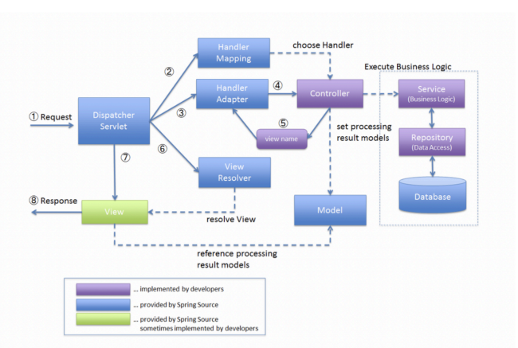

# 📖 MVC Practice
> MVC Pattern에 이용되는 DispatcherServlet, HandlerMapping, HandlerAdapter, ViewAndResolver 등을 직접 코드로 구현해보며 학습하고 어노테이션을 정의하여 사용해본다.

 

## 🧰 Library Usage
- Junit5 
  - version 5.9.0
- Reflection : 힙 영역에 로드돼 있는 클래스 타입의 객체를 사용할 수 있도록 해준다.
  - version 0.10.2
- Logback
  - version 1.4.4

 

## 📓 Study Summary
### 👉 Reflection
- 힙 영역에 로드돼 있는 클래스 타입의 객체를 통해 필드/메소드/생성자를 접근 제어자와 상관 없이 사용할 수 있도록 지원하는 API이다.
- 컴파일 시점이 아닌 런타임 시점에 동적으로 특정 클래스의 정보를 추출해낼 수 있는 프로그래밍 기법이다.
- 주로 프레임워크 또는 라이브러리 개발 시 사용된다.
- Spring DI, JUnit, Jackson 등에 사용된다.
- [Guide](https://www.baeldung.com/reflections-library)
### 👉 MVC
#### 1️⃣ 프런트 컨트롤러 패턴
- 모든 요청을 단일 handler(처리기)에서 처리하도록 하는 패턴이다.
- 스프링 웹 MVC 프레임워크의 DispatcherServlet이 프런트 컨트롤러 패턴으로 구현돼 있다.

#### 2️⃣ Forward
- 서블릿에서 클라이언트를 거치지 않고 바로 다른 서블릿(또는 JSP)에게 요청하는 방식이다.
- 서버 내부에서 일어나는 요청이기 때문에 HttpServletRequest, HttpServletResponse객체가 새롭게 생성되지 않고 공유된다.

#### 3️⃣ Redirect
- 서블릿이 클라이언트를 다시 거쳐 다른 서블릿(또는 JSP)에게 요청하는 방식이다.
- 클라이언트로부터 새로운 요청이기 때문에 새로운 HttpServletRequest, HttpServletResponse 객체가 생성된다.
#### 4️⃣ [Spring Web MVC Framework](https://docs.spring.io/spring-framework/docs/3.2.x/spring-framework-reference/html/mvc.html)

