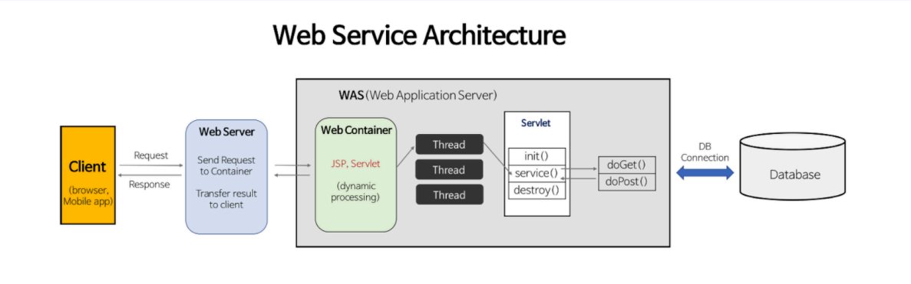

# 📖 WAS Practice
> WAS를 직접 구현해보며 HTTP Protocol의 이해와 Web Application Server를 이해한다.

- 사용자 요청을 메인 Thread가 처리하도록 한다.
- 사용자 요청이 들어올 때마다 Thread를 새로 생성하여 요청을 처리 하도록 한다.
- Thread Pool을 적용해 안정적인 서비스가 가능하도록 한다
 

## 🧰 Library Usage
- Junit5 
  - version 5.9.0
- AssertJ : 테스트 코드 가독성을 높여주는 자바 라이브러리
  - version 5.9.0
- Logback : 로그를 기록하기 위한 SLF4J의 구현체
  - version 1.4.4

 

## 📓 Study Summary
### 👉 HTTP 프로토콜 이해
서버와 클라이언트가 웹에서 데이터를 주고받기 위한 통신 규약
- HTTP/1.1 , HTTP/2는 TCP 기반 위에서 동작
- HTTP/3는 UDP 기반 위에서 동작

### 👉 HTTP 요청/응답 메시지 구조
#### 1️⃣ HttpRequest
- RequestLine
- Header
- BlankLine
- Body

#### 2️⃣ HttpResponse
- StatusLine
- Header
- BlankLine
- Body

### 👉 Servlet Programming
#### 1️⃣ CGI (Common Gateway Interface)
- 서버와 어플리케이션 사이에 데이터를 주고 받는 규약
- 컴파일 방식(C,C++,Java 등) / 인터프리터 방식(PHP,Python 등)

#### 2️⃣ Servlet
> Server + Applet 합성어로 동적인 페이지 구현을 위한 표준 기술
- Servlet Container
  - 서블릿의 라이프사이클을 관리
  - 웹서버와 소켓을 만들고 통신하는 과정을 대신 처리해준다.
  - 서블릿 객체는 싱글톤으로 관리된다.
    - Thread safety하지 않다.
    - 상태 유지(stateful)하게 설계하면 안된다.
      > Spring Bean이 기본값인 싱글톤으로 관리되어 유의해야한다. 
- RaceCondition 
  - 여러 프로세스 혹은 쓰레드가 동시에 하나의 자원에 접근하기 위해 경쟁하는 상태를 의미한다.